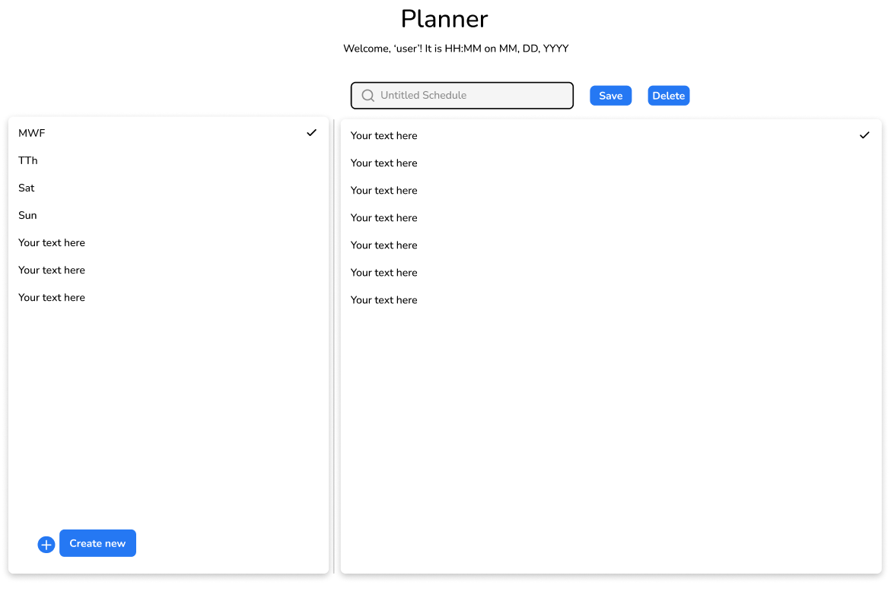

# Planner/Scheduler

## Description

This project is for users who wish to plan out a day. The user can save a schedule and add it to their account. This allows for users to reuse a saved schedule if it will be used regularly. For example, User A wishes to plan out his weekdays and weekends separately, and thus creates one schedule for weekdays and one for weekends. User B wishes to have an alternating schedule for MWF and TTh, thus creating two schedules accordingly. Saved schedules will be available in a list on the left of the screen (or a menu item for mobile), while the schedule itself will be available on the right (and majority) of the screen (or the whole width of the page for mobile).

My motivation for this project is I would like a convenient application to create and store schedules that can be categorized by the day of the week. It can get quite annoying to have infinitely recurring items on, for example, Google Calendar, which takes attention away from specific/unique events.

The premise for this project comes from a Columbia Coding Bootcamp assignment titled 'Daily Planner' or 'Work Day Scheduler'. I felt limited that the project only handled 9AM-5PM (typical working hours); I disliked the system of clicking save for each time block; and I felt like it would be more beneficial for the user to be able to create and store multiple schedules to fit their needs and preferences. I liked the incorporation of time in the top; I liked the idea of different coloration depending on time and status; and I liked the overall layout of time blocks.

## Table of Contents (Optional)

- [Installation](#installation)
- [Usage](#usage)
- [Design](#design)
- [Credits](#credits)
- [License](#license)

## Installation

This application is a deployed application, meaning it does not need to be separately installed. To build upon / test the code, please use `npm i` to install necessary dependencies, then `npm run start` to start the application on a live local server.

## Usage

Provide instructions and examples for use. Include screenshots as needed.

To add a screenshot, create an `assets/images` folder in your repository and upload your screenshot to it. Then, using the relative filepath, add it to your README using the following syntax:

    ```md
    
    ```

Upon first load of page, please sign-in or login if you have already created an account.

Once logged in, you will see the basic page layout divided into three main sections:

    First, the top portion displays a simple welcome message with your name and the time and date.

    Second, the left panel displays existing saved schedules and an option to add a new schedule at the bottom.

    Third, the right panel and bulk of the page displays the time slots of the day, color coded depending on if the time has passed already and whether a schedule item already exists within it. Each time block will show the time on the left, a large area for users to input text, and an input field for title and buttons to save or delete the schedule at the top of the panel.

Either choose an existing schedule or click the button to create a new schedule, then input your schedule items. Click save once complete, or click delete to delete the schedule.

## Design

Please see below for a mockup figma design of how the desktop layout would look like.
<br>

<br>

## Credits

List your collaborators, if any, with links to their GitHub profiles.

If you used any third-party assets that require attribution, list the creators with links to their primary web presence in this section.

If you followed tutorials, include links to those here as well.

## License

The last section of a high-quality README file is the license. This lets other developers know what they can and cannot do with your project. If you need help choosing a license, refer to [https://choosealicense.com/](https://choosealicense.com/).